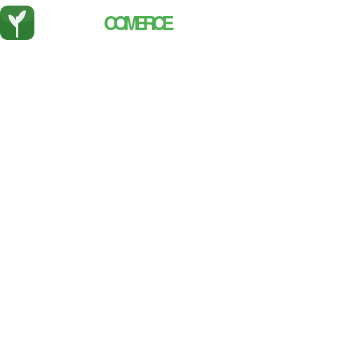
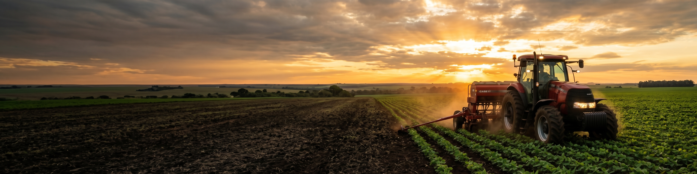
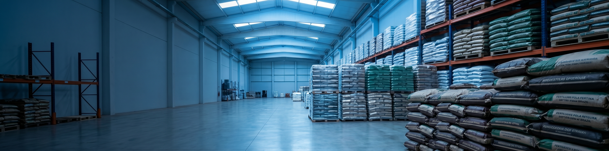

<div align="center">
  

  # AgroCommerce

  **Marketplace B2C multi-loja para o agronegócio**

  [](https://isaulof.github.io/agrocommerce/)
  [](https://developer.mozilla.org/docs/Web/HTML)
  [](https://developer.mozilla.org/docs/Web/CSS)
  [](https://developer.mozilla.org/docs/Web/JavaScript)
  [](LICENSE)

  *"Antes da porteira, a AgroCommerce resolve."*

  **[🌐 Ver Demo ao Vivo](https://isaulof.github.io/agrocommerce/)**
</div>

---

## Sobre o Projeto

**AgroCommerce** é um marketplace que conecta produtores rurais a fornecedores verificados (CNPJs), com foco em insumos do campo: ração, adubos, defensivos agrícolas, medicamentos veterinários de venda livre, arames e sementes.

O modelo de negócio é B2C multi-loja — cada fornecedor tem sua própria vitrine, e o produtor navega, compara preços e fecha negócio em um só lugar. A plataforma cobra **14% de comissão** por transação concluída e é auto-sustentável sem necessidade de estoque próprio.

Projeto acadêmico desenvolvido para a feira de empreendedorismo do curso de **Agrocomputação — UNEMAT**, simulando uma startup real com análise de mercado, modelo de receita e foco inicial no estado de **Mato Grosso**.

---

## Demonstração

| Landing Page | Marketplace | Detalhes do Produto |
|:---:|:---:|:---:|
| [](https://isaulof.github.io/agrocommerce/) | [](https://isaulof.github.io/agrocommerce/marketplace.html) | [](https://isaulof.github.io/agrocommerce/anuncio.html) |

---

## Páginas

| Arquivo | Descrição |
|---------|-----------|
| [`index.html`](index.html) | Landing page institucional — apresentação completa do produto |
| [`marketplace.html`](marketplace.html) | Feed de produtos com busca debounced e filtros por categoria |
| [`anuncio.html`](anuncio.html) | Detalhe do produto: galeria, especificações, chat e fechamento de negócio simulado |
| [`produto.html`](produto.html) | Página de produto do marketplace |
| [`perfil.html`](perfil.html) | Perfil público do lojista com rating, reviews e grid de produtos |
| [`loja.html`](loja.html) | Vitrine da loja do fornecedor |
| [`lojista.html`](lojista.html) | Dashboard do lojista — gestão de produtos e pedidos |
| [`carrinho.html`](carrinho.html) | Carrinho de compras |
| [`checkout.html`](checkout.html) | Fluxo de checkout |
| [`admin.html`](admin.html) | Painel administrativo — moderação de denúncias, usuários e produtos |
| [`apresentacao.html`](apresentacao.html) | Apresentação institucional para investidores e parceiros |
| [`tv.html`](tv.html) | Painel de exibição em TV (modo apresentação para eventos) |

---

## Stack

| Camada | Tecnologia |
|--------|-----------|
| Marcação | HTML5 semântico |
| Estilo | CSS3 puro — sem framework |
| Lógica | JavaScript ES6 Vanilla |
| Persistência | `localStorage` — client-side |
| Deploy | GitHub Pages — 100% estático |
| Fontes | Montserrat + Inter via Google Fonts |
| Ícones | Font Awesome 6 via CDN |

> Sem dependências de servidor. Sem build step. Abre direto no navegador.

---

## Estrutura do Projeto

```
agrocommerce/
├── index.html              # Landing page
├── marketplace.html        # Feed de produtos
├── anuncio.html            # Detalhe do produto + chat
├── produto.html            # Página de produto
├── perfil.html             # Perfil do lojista
├── loja.html               # Vitrine da loja
├── lojista.html            # Dashboard do lojista
├── carrinho.html           # Carrinho
├── checkout.html           # Checkout
├── admin.html              # Painel administrativo
├── apresentacao.html       # Apresentação institucional
├── tv.html                 # Painel para TV
│
├── css/
│   ├── marketplace.css     # Design system principal
│   └── analytics.css       # Estilos de analytics
│
├── js/
│   ├── data.js             # Seed data + Storage layer + utilitários
│   ├── catalog.js          # Busca e filtros do marketplace
│   ├── product.js          # Página de produto
│   ├── anuncio.js          # Anúncio, chat e deals
│   ├── cart.js             # Carrinho de compras
│   ├── checkout.js         # Checkout
│   ├── profile.js          # Perfil do lojista
│   ├── store.js            # Vitrine da loja
│   ├── lojista.js          # Dashboard do lojista
│   ├── admin.js            # Painel administrativo
│   └── analytics.js        # Métricas e relatórios
│
├── itens/                  # Imagens dos produtos (ração, adubos, sementes…)
├── banners_img/            # Banners e assets visuais
├── logo.svg                # Marca principal
└── logo-claro.svg          # Versão clara da marca
```

---

## Como Rodar Localmente

Nenhuma instalação necessária — tudo estático.

```bash
# 1. Clone o repositório
git clone https://github.com/isaulof/agrocommerce.git
cd agrocommerce

# 2a. Abra direto no navegador
open index.html          # macOS
xdg-open index.html      # Linux

# 2b. Ou rode um servidor local (recomendado para evitar restrições de CORS)
npx serve .
# acesse → http://localhost:3000
```

Ou acesse o deploy: **[https://isaulof.github.io/agrocommerce/](https://isaulof.github.io/agrocommerce/)**

---

## Paleta de Cores

| Cor | Hex | Uso |
|-----|-----|-----|
| Verde principal | `#2E7D32` | Primária, navbar, botões |
| Verde claro | `#4CAF50` | Hover, destaques |
| Dourado / CTA | `#FFB300` | Chamadas para ação |
| Azul confiança | `#1565C0` | Selos de verificação CNPJ |
| Fundo escuro | `#0A120B` | Background geral |

---

## Equipe

| Membro | Papel |
|--------|-------|
| Saulo | CEO & Desenvolvedor |
| Levi | CTO & Analista |
| Carlos | Head de Produto |
| Yago | Head de Operações |

---

## Contexto Acadêmico

Projeto desenvolvido no curso de **Agrocomputação** da **UNEMAT** (Universidade do Estado de Mato Grosso) para a feira de empreendedorismo. O escopo cobre insumos do dia a dia do campo — ração, adubos, defensivos, medicamentos veterinários, arames e sementes — excluindo intencionalmente peças e maquinário agrícola pesado.

---

## Licença

Distribuído sob a licença [MIT](LICENSE).

---

<div align="center">
  Desenvolvido com dedicação pela equipe AgroCommerce &mdash; UNEMAT 2026
</div>
